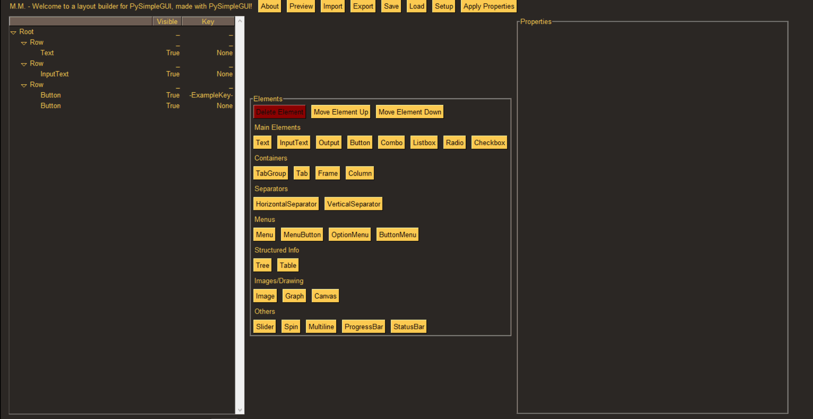

# SimpleGUIBuilder

> A GUI for designing Python GUI's for PySimpleGUI.

## Installation

There is none :) just download the file from a release and run it. 
Don't download from anywhere else (should it appear somewhere else it's not mine).

Exec made with pyinstaller

## About

I don't really like frontend but I really like the idea of giving my backend/terminal programs something more pleasurable to interact with.

That's when I came across [PySimpleGUI](https://github.com/PySimpleGUI/PySimpleGUI), a simple solution to quickly give my programs an interactive front.
But in checking it out I found I wanted more and had an idea:
It would be nice if PySimpleGUI and therefore GUI making was in itself more interactive.

And that's how SimpleGUIBuilder came to be:
A GUI for creating/designing GUI's layouts for PySimpleGUI, made with PySimpleGUI.

I hope this will be useful to people :)

## How it works

Quick disclaimer:
With this being a tool for making GUI layouts for PySimpleGUI, you will need to know the basics of how PySimpleGUI works.
But worry not, quick experimentation with the SimpleGUIBuilder will also help you in learning it faster. And as advertised in the name, it should be simple ;)
I recommend you start [here](https://pysimplegui.trinket.io/demo-programs#/demo-programs/the-basic-pysimplegui-program) and then use
[PySimpleGUI Docs](https://pysimplegui.readthedocs.io/en/latest/) as needed.


Lets get on with the show. There's mainly 2 steps in creating a GUI with PySimpleGUI:
1. Design the GUI, by creating it's correspondent layout;
2. Create the window and map your code to the GUI through the event loop.

SimpleGUIBuilder will help you with the 1st step, with designing the GUI's layout for PySimpleGUI.

It's easier to show then to explain here, so I made a quick video where I create [this simple GUI](https://pysimplegui.trinket.io/demo-programs#/demo-programs/the-basic-pysimplegui-program).
(video got downgraded to gif for now, I might still make a video later if i can)



Example layout used:
```
[ 
  [sg.Text('This is a very basic PySimpleGUI layout')],
  [sg.Input()],
  [sg.Button('Button'), sg.Button('Exit')]
]
```

### **IMPORTANT NOTES:** 

* SimpleGUIBuilder will automatically save your work every 3 minutes and when you close the window. It will save to an autosave.txt file in the same folder of the program. When starting, it will also autoload from the autosave file if there is one.

* If you import an empty layout, [] , it will basically clear the current layout being built. Should be useful instead of manually deleting everything.

* Don't forget to press **Apply Properties** to save your property changes.

## More info

Hopefully the SimpleGUIBuilder's GUI is intuitive and easy to pick up, but I will also explain it here.

There's 3 huge sections:
* **Left - Element Tree**: It shows the layout's structure in a tree form. It's where you can select elements.

* **Middle - Element Action**: Where you can choose to add/remove/move an element.

* **Right - Element Properties**: It's shows all of the element's properties. Here you can also change a property and click **Apply Properties** to apply. 
You can think of properties like the initial arguments of an element, because that's exactly what it is.


On the top you have a bunch of action buttons:
* **About**: The about :)

* **Preview**: A truly magical button that immediately shows you a preview of how the GUI will look like for the layout you're building.

* **Import**: Give it a layout, like the one above, and it will import it.

* **Export**: Gives you the layout for the GUI you built.

* **Save**: Exports the layout and saves it into a file.

* **Load**: Imports the layout from a file.

* **Setup**: Creates a file based on this [template](https://pysimplegui.trinket.io/demo-programs#/demo-programs/the-basic-pysimplegui-program) but with your layout already in it. Should help you quickly get onto the 2nd step mentioned in the previous section ("Create the window and map your code to the GUI").

* **Apply Properties**: When you change the properties of an element you click here, it will apply and save then. You can then immediately see the changes on the GUI with the "Preview" button (depending on the property you change actually doing a visible change ofc).

## Support

If you find this useful consider supporting and buying me coffee :) https://www.buymeacoffee.com/MMartins

<a href="https://www.buymeacoffee.com/MMartins"></a>

And this wouldn't be possible without PySimpleGUI, so they also really deserve it ;) https://www.buymeacoffee.com/PySimpleGUI 
